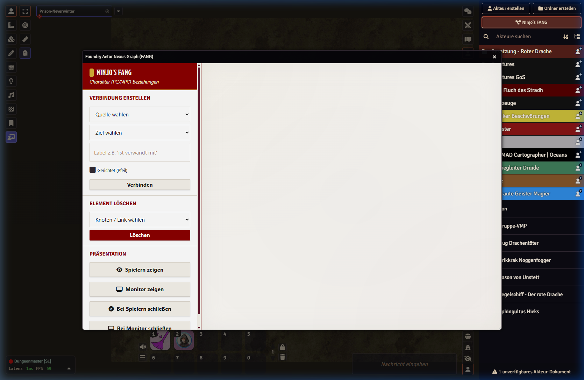
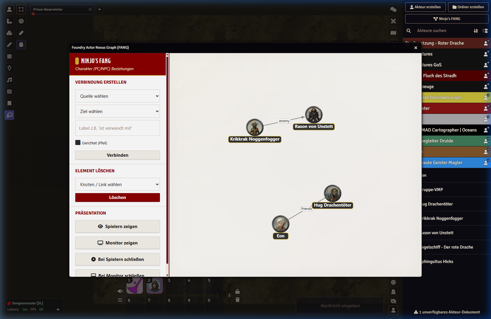
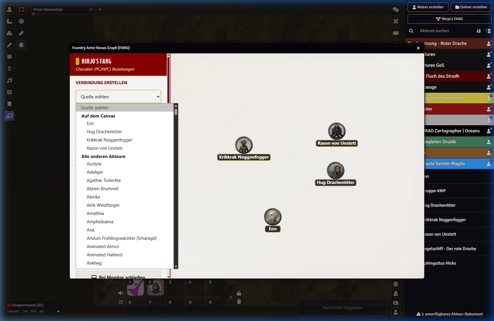

# Ninjo's FANG (Foundry Actor Nexus Graph)

An interactive, self-arranging Actor Graph module for visualizing Character & NPC Relationships natively in Foundry VTT V13. FANG enables Game Masters and players to dynamically map out self-building relationship networks inside their game world.

*(Scroll down for German version / Scrolle weiter runter für die deutsche Version)*

---

## 🇬🇧 English

### Features

  
  
  

- **Self-Arranging Actor Graph:** View actors and their relationships as nodes and links in a dynamic system that automatically organizes itself for clarity.
- **Interactive Drag & Drop:** Seamlessly drag Actors directly from your Foundry sidebar onto the FANG canvas. Drop them into empty space to instantly spawn a node, or drop them onto an existing node to quickly build a new connection!
- **Directional Links:** Optionally add arrows to connections to clearly denote relationship direction.
- **Smart Connection Menus:** The source and target dropdowns are intelligently split into "On Canvas" and "Other Actors", completely eliminating tedious scrolling in larger campaigns.
- **Node & Link Management:** GMs can effortlessly add tokens, create links, and remove connections as the story progresses.
- **Player Sharing:** GMs can push the current graph view to all connected players, ensuring everyone is on the same page.
- **GM Controls:** Includes dedicated "Close for Players", "Show Monitor", and "Close Monitor" buttons for seamless presentation management.
- **Multi-Language Support (I18n):** Automatically translates to English or German based on your Foundry core language settings.

### Installation
1. Start Foundry VTT and navigate to the **Add-on Modules** tab.
2. Click **Install Module**.
3. Paste the following Manifest URL: `https://github.com/Niclasp1501/Foundry-Actor-Nexus-Graph--FANG-/releases/latest/download/module.json`
4. Restart Foundry and enable **Foundry Actor Nexus Graph (FANG)** in your World's module settings.

### Usage
#### For the Game Master (GM)
1. **Opening FANG:** Click the new "Ninjo's FANG" button inside the **Actors Directory** header, or press `Shift + G`.
2. **Adding Nodes:** Use the side panel to add connections. If the token doesn't exist on the board yet, it will automatically be pulled from your Actors directory.
3. **Sharing the Graph:** 
   - When you are ready, click **"Show Players"** in the Presentation tab.
   - This sends the data to the background Journal and automatically opens a read-only view on your players' screens.
4. **Closing the Graph:** Use **"Close for Players"** to instantly close the window on their screens.

#### For the Players
- **Initial Setup:** The GM must open the graph at least once to initialize the background data.
- **Viewing the Graph:** Once shared by the GM, the window will pop up automatically.
- **Manual Access:** If a player accidentally closes the window, they can re-open it via the **"FANG Graph" Journal Entry** (a link inside the journal text opens the tool) or simply by pressing `Shift + G`.

### Future Roadmap
- **Center Pinning:** Anchor important actors (e.g. the main villain) to the center of the graph.
- **Viewport Locking:** Ensure actors remain visible inside the GM's and Monitor's screens.
- **More Languages:** Community translation support (e.g. Spanish, French).

---

## 🇩🇪 Deutsch

### Features

  
  
  

- **Selbstanordnender Akteur-Graph:** Betrachte Akteure und ihre Verbindungen in einem dynamischen System, das sich für maximale Übersichtlichkeit automatisch selbst aufbaut und strukturiert.
- **Intuitives Drag & Drop:** Ziehe Foundry Akteure einfach per Drag & Drop direkt aus der Sidebar auf die FANG Zeichenfläche! Ein Wurf ins Leere erstellt sofort einen neuen Knoten, ein Wurf exakt auf einen bestehenden Knoten generiert direkt eine neue Verbindung.
- **Pfeilrichtungen:** Setze optional Pfeile an Verbindungslinien, um anzuzeigen, von wem die Beziehung ausgeht.
- **Smarte Verbindungsmenüs:** Die Quelle- und Ziel-Dropdowns sind in "Auf dem Canvas" und "Alle anderen Akteure" gegliedert. Das verhindert endloses Scrollen bei Spielwelten mit riesigen NPC-Listen!
- **Knoten & Verbindungen Verwalten:** GMs können mühelos Tokens hinzufügen, miteinander verbinden und veraltete Elemente löschen.
- **Mit Spielern Teilen:** Der GM kann die aktuelle Graphen-Ansicht mit einem Klick an alle Spieler schicken.
- **GM Kontroll-Panel:** Dedizierte Knöpfe wie "Bei Spielern schließen", "Monitor zeigen" und "Bei Monitor schließen" erleichtern die Spielpräsentation.
- **Mehrsprachigkeit (I18n):** Das Modul ist komplett auf Englisch und Deutsch verfügbar.

### Installation
1. Starte Foundry VTT und wechsle in den **Zusatzmodule** Reiter.
2. Klicke auf **Modul installieren**.
3. Füge die folgende Manifest URL ein: `https://github.com/Niclasp1501/Foundry-Actor-Nexus-Graph--FANG-/releases/latest/download/module.json`
4. Starte Foundry neu und aktiviere **Foundry Actor Nexus Graph (FANG)** in den Modul-Einstellungen deiner Welt.

### Anleitung
#### Für den Spielleiter (GM)
1. **FANG Öffnen:** Klicke auf den neuen Button "Ninjo's FANG" oben im **Akteurs-Verzeichnis**, oder drücke `Shift + G`.
2. **Knoten Hinzufügen:** Über die Seitenleiste kannst du Verbindungen herstellen. Fehlt ein Akteur auf dem Board, zieht sich FANG diesen direkt aus deinem Verzeichnis.
3. **Den Graphen Teilen:** 
   - Klicke im Reiter "Präsentation" auf **"Spielern zeigen"**.
   - FANG speichert die Daten in einem Hintergrund-Journal und öffnet das Graphen-Fenster synchron bei allen Spielern.
4. **Graphen Schließen:** Mit **"Bei Spielern schließen"** verschwindet das Fenster sofort von ihren Monitoren.

#### Für die Spieler
- **Einrichtung:** Der GM muss das Tool einmalig öffnen, damit das Journal im Hintergrund erstellt wird.
- **Graphen Betrachten:** Sobald der GM den Graphen teilt, öffnet sich dieser automatisch.
- **Manuell Öffnen:** Falls du das Fenster versehentlich schließt, kannst du es über das **Journal "FANG Graph"** wieder öffnen (Klick auf den Link im Text) oder einfach `Shift + G` drücken.

### Zukünftige Pläne (Roadmap)
- **Zentrierung:** Bestimmte Akteure (z.B. den Haupt-Bösewicht) in der Mitte des Bildschirms fixieren/ankern.
- **Monitor-Sichtfeld:** Sicherstellen, dass die Akteure immer im sichtbaren Bereich des Monitors/GMs bleiben.
- **Weitere Sprachen:** Bei Bedarf werden auf Wunsch gern weitere Übersetzungen integriert.

---

## Credits & Third-Party Libraries
This module leverages the following open-source libraries:
* [D3.js](https://d3js.org/) - Licensed under the ISC License.

---

## License / Lizenz
This base module is licensed under the MIT License. 
**Note:** This license applies only to the core "Foundry Actor Nexus Graph (FANG)" module. Future add-ons, premium themes, or extended feature packs may be released under separate, proprietary licenses.

Dieses Basis-Modul steht unter der MIT-Lizenz. 
**Hinweis:** Diese Lizenz gilt nur für das Kernmodul "Foundry Actor Nexus Graph (FANG)". Zukünftige Premium-Erweiterungen, Themes oder Content-Pakete können unter separaten, proprietären Lizenzen veröffentlicht werden.

