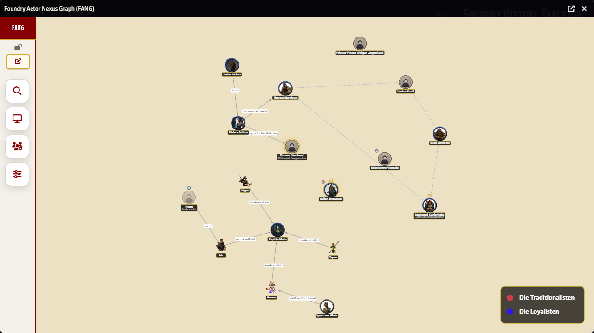
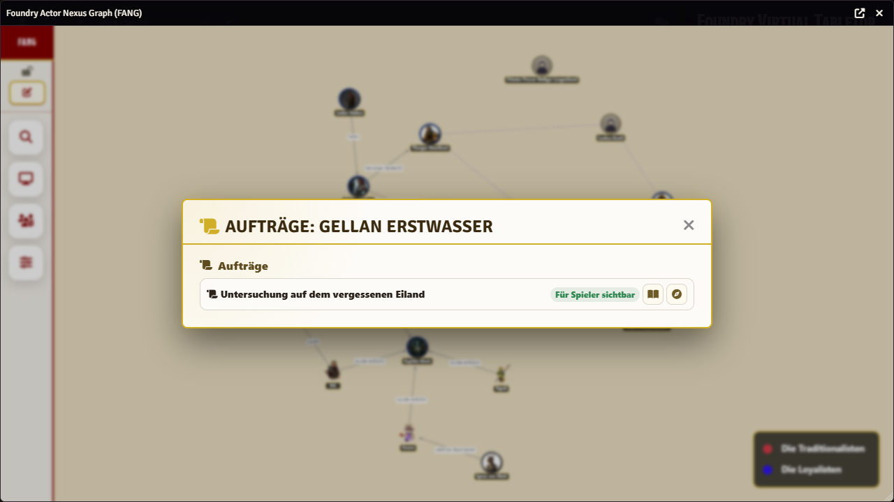
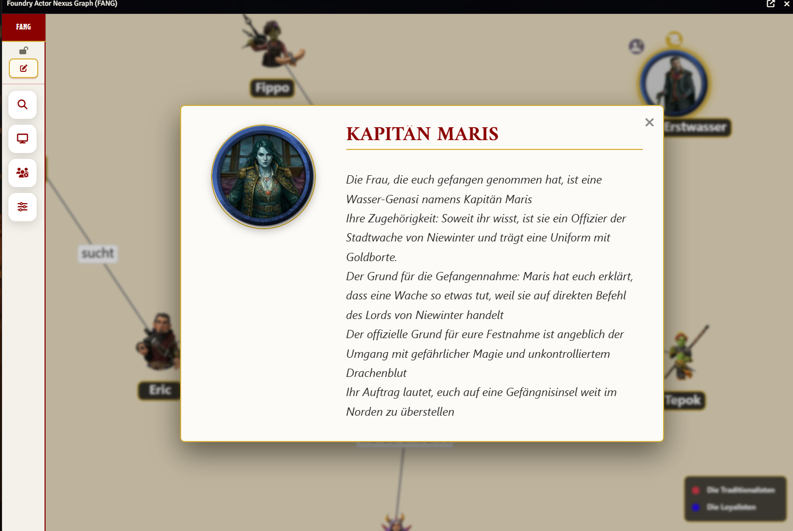

# Ninjo's FANG (Foundry Actor Nexus Graph)

**Current Version / Aktuelle Version:** 2.0.12

An interactive, self-arranging Actor Graph module for visualizing Character & NPC Relationships natively in Foundry VTT V13 and V14. FANG enables Game Masters and players to dynamically map out self-building relationship networks inside their game world.

*(Scroll down for German version / Scrolle weiter runter für die deutsche Version)*

---

## 🇬🇧 English

### Features

  
  
  

- **In-Person Gaming Mode:** Enable a specialized workflow for local gaming sessions. Includes toggleable monitor controls that appear dynamically in the UI.
- **Configurable Monitor Name:** Specify exactly which user/display represents your group monitor (e.g., "TV-Display"). FANG uses smart name-matching to target the right screen.
- **Live Physics Controls:** Fine-tune the simulation's "Cosmic Wind" and strength directly from the View tab. Changes sync instantly across all connected clients.
- **Cinematic Monitor Focus (Boss Pivot):** Dedicated Monitor accounts keep the focus strictly on "Center" nodes. The camera pivots around the story's anchor points for a perfect big-screen experience.
- **Connection Editing & Spotlight:** Right-click relationships to rename them, add lore, or cast a cinematic dual-portrait Spotlight with glowing directional arrows.
- **Context Menu & Character Portraits:** Right-click any token to reveal a sleek Radial Context menu! Narrative features now support high-resolution actor portraits instead of just token images.
- **Precise Coordinate Dragging:** Fully corrected coordinate tracking ensures tokens stay perfectly under your mouse during drag-and-drop, even when zoomed or panned.
- **Roles & Organizations:** Assign roles or faction affiliations to individual tokens, adding secondary layers of depth to the map.
- **Gravity Center (Boss Nodes):** Magnetically anchor important actors (e.g., villains) to the center of the graph with a customizable glowing aura.
- **Visual Grouping:** Group actors (e.g., by location) with visual bounding boxes or cluster zones.
- **Link Label Validation:** Ensures all connections have mandatory labels to prevent confusing "invisible" links.
- **JSON Export & Import (Backup):** Save your entire graph (including token positions, factions, and visual settings) to a file. Perfect for backups or sharing templates.
- **Customizable Backgrounds (Live Sync):** Customize the graph background via palette colors, custom images (blur/opacity), or style presets. Syncs live to players/monitors.
- **Search & Filter Overlay:** Search nodes, roles, factions, or links locally inside the graph, highlight exact matches, and optionally isolate only the relevant results.
- **Placeholder NPC Workflow:** Add placeholder contacts directly on the canvas, then replace them later with real Actors via drag-and-drop or the context menu while keeping graph links intact.
- **Quest Log + Quest Spotlight:** Link one or multiple Quest Journals per node and open them via context menu / in-canvas picker. Quest Spotlights support monitor auto-scroll + synced scroll.
- **Only-Sheet Compatibility:** Optional setting to replace the Only-Sheet actor button and inject quick-access buttons for Actors and FANG.
- **DiploGlass One-Way Faction Sync (Optional):** If DiploGlass is installed, FANG can import/sync factions (name, icon, journal/rolltable refs) one-way into FANG. Includes a first-time GM prompt and automatic node-to-faction assignment based on DiploGlass per-character reputation.
- **Multi-Language Support (I18n):** Automatically translates to English or German based on Foundry settings.

### Installation
1. Start Foundry VTT and navigate to the **Add-on Modules** tab.
2. Click **Install Module**.
3. Paste the following Manifest URL: `https://github.com/Niclasp1501/Foundry-Actor-Nexus-Graph--FANG-/releases/latest/download/module.json`
4. Restart Foundry and enable **Foundry Actor Nexus Graph (FANG)** in your World's module settings.

### Usage
#### For the Game Master (GM)
1. **Opening FANG:** Click the new "Ninjo's FANG" button inside the **Actors Directory** header, or press `Shift + G`.
2. **Adding Nodes:** Use the side panel to add connections. If the token doesn't exist on the board yet, it will automatically be pulled from your Actors directory.
3. **Sharing the Graph:** 
   - Click **"Show Players"** to open a read-only window for all players.
   - Use **"Show Monitor"** (available in In-Person mode) to send a specialized fullscreen view to your dedicated monitor user.
4. **Closing the Graph:** Use **"Close for Players"** or **"Close Monitor"** to instantly manage remote views.

#### For the Players
- **Initial Setup:** The GM must open the graph at least once to initialize the background data.
- **Viewing the Graph:** Once shared by the GM, the window will pop up automatically.
- **Manual Access:** If a player accidentally closes the window, they can re-open it via the **"FANG Graph" Journal Entry** (a link inside the journal text opens the tool) or simply by pressing `Shift + G`.

### Future Plans & Roadmap
For the current development status and planned features, please refer to the [TODO.md](TODO.md) file.

---

## 🇩🇪 Deutsch

### Features

  
  
  

- **In-Person Gaming Modus:** Spezialisierter Workflow für Vor-Ort-Runden. Schaltet optimierte Monitor-Steuerelemente frei, die dynamisch in der UI erscheinen.
- **Anpassbarer Monitor-Name:** Leg genau fest, welcher Benutzer/Monitor angesteuert werden soll (z. B. "TV-Display"). FANG nutzt intelligentes Name-Matching, um das Bild auf das richtige Ziel zu übertragen.
- **Live-Physik-Steuerung:** Justiere den "Kosmischen Wind" und dessen Stärke direkt im Reiter "Ansicht". Änderungen werden in Echtzeit an alle verbundenen Spieler synchronisiert.
- **Cinematische Monitor-Zentrierung (Boss-Pivot):** Monitor-Accounts fixieren den Bildausschnitt starr auf den als "Zentrum" markierten Boss-Nodes für ein perfektes Public-Display-Erlebnis.
- **Verbindungen Bearbeiten & Spotlight:** Rechtsklick auf Beziehungen, um sie umzubenennen, eigene Notizen hinzuzufügen oder ein kinematisches Dual-Porträt-Spotlight mit leuchtenden Pfeilen auszulösen.
- **Kontextmenü & Charakter-Porträts:** Ein Rechtsklick öffnet ein radiales Kontextmenü! Das Spotlight unterstützt nun detaillierte Akteur-Bilder anstelle von simplen Token-Grafiken.
- **Präzises Drag & Drop:** Korrigierte Koordinaten-Berechnung sorgt dafür, dass Tokens beim Ziehen exakt unter der Maus bleiben, auch wenn du gezoomt hast.
- **Rollen & Fraktionen:** Weise Rollen oder Fraktionen zu, um dem Netzwerk eine völlig neue Organisationstiefe zu verleihen.
- **Zentrums-Gravitation (Boss-Knoten):** Verankere wichtige Akteure magnetisch in der Mitte des Graphen, inklusive leuchtender Aura.
- **Visuelle Gruppierung:** Fasse Akteure (z.B. nach Standort) optisch in Gruppen oder Zonen zusammen.
- **Verbindungs-Validierung:** Stellt sicher, dass jede Verbindung eine Beschriftung hat, um "unsichtbare" Linien zu vermeiden.
- **JSON Export & Import (Backup):** Speichere deinen gesamten Graphen (inkl. Token-Positionen, Fraktionen und Einstellungen) in einer Datei. Ideal für Backups oder zum Teilen.
- **Anpassbarer Hintergrund (Live-Sync):** Passe den Hintergrund über Farbpalette, eigene Bilder (Blur/Deckkraft) oder Stil-Presets an. Wird live an Spieler/Monitor synchronisiert.
- **Such- & Filter-Overlay:** Durchsuche Knoten, Rollen, Fraktionen oder Verbindungen direkt im Graphen, hebe Treffer hervor und isoliere bei Bedarf nur die relevanten Ergebnisse.
- **Platzhalter-NPC-Workflow:** Lege Platzhalter direkt im Graphen an und ersetze sie spaeter per Drag & Drop oder Kontextmenue durch echte Akteure, ohne Verbindungen neu bauen zu muessen.
- **Quest Log + Quest Spotlight:** Verknüpfe ein oder mehrere Quest-Journale pro Knoten und öffne sie über Kontextmenü / In-Canvas-Auswahl. Quest-Spotlights unterstützen Monitor Auto-Scroll + synchronisiertes Scrollen.
- **Only-Sheet Kompatibilität:** Optionale Einstellung, um den Only-Sheet Actor-Button zu ersetzen und Quick-Buttons für Akteure und FANG einzublenden.
- **DiploGlass Einweg-Fraktionssync (Optional):** Wenn DiploGlass installiert ist, kann FANG Fraktionen (Name, Icon, Journal-/RollTable-Referenzen) einseitig nach FANG importieren/synchronisieren. Enthält einen einmaligen GM-Dialog und eine automatische Knoten-zu-Fraktion-Zuordnung auf Basis der DiploGlass-Charakterreputation.
- **Mehrsprachigkeit (I18n):** Das Modul ist komplett auf Englisch und Deutsch verfügbar.

### Installation
1. Starte Foundry VTT und wechsle in den **Zusatzmodule** Reiter.
2. Klicke auf **Modul installieren**.
3. Füge die folgende Manifest URL ein: `https://github.com/Niclasp1501/Foundry-Actor-Nexus-Graph--FANG-/releases/latest/download/module.json`
4. Starte Foundry neu und aktiviere **Foundry Actor Nexus Graph (FANG)** in den Modul-Einstellungen deiner Welt.

### Anleitung
#### Für den Spielleiter (GM)
1. **FANG Öffnen:** Klicke auf den neuen Button "Ninjo's FANG" oben im **Akteurs-Verzeichnis**, oder drücke `Shift + G`.
2. **Knoten Hinzufügen:** Über die Seitenleiste kannst du Verbindungen herstellen. Fehlt ein Akteur auf dem Board, zieht sich FANG diesen direkt aus deinem Verzeichnis.
3. **Den Graphen Teilen:** 
   - Klicke auf **"Spielern zeigen"**, um ein Lese-Fenster für alle Spieler zu öffnen.
   - Nutze **"Monitor zeigen"** (im In-Person Modus verfügbar), um ein spezielles Vollbild an deine Player-Display zu senden.
4. **Graphen Schließen:** Mit **"Bei Spielern schließen"** oder **"Monitor schließen"** verwaltest du die Remote-Fenster deiner Runde.

#### Für die Spieler
- **Einrichtung:** Der GM muss das Tool einmalig öffnen, damit das Journal im Hintergrund erstellt wird.
- **Graphen Betrachten:** Sobald der GM den Graphen teilt, öffnet sich dieser automatisch.
- **Manuell Öffnen:** Falls du das Fenster versehentlich schließt, kannst du es über das **Journal "FANG Graph"** wieder öffnen (Klick auf den Link im Text) oder einfach `Shift + G` drücken.

### Zukünftige Pläne & Roadmap
Den aktuellen Stand der Entwicklung und geplante Features findest du in der Datei [TODO.md](TODO.md).

---

## Credits & Third-Party Libraries
Special thanks to **GM MattCat** for bringing in the DiploGlass faction sync idea.

This module leverages the following open-source libraries:
* [D3.js](https://d3js.org/) - Licensed under the ISC License.

---

## License / Lizenz
This base module is licensed under the MIT License. 
**Note:** This license applies only to the core "Foundry Actor Nexus Graph (FANG)" module. Future add-ons, premium themes, or extended feature packs may be released under separate, proprietary licenses.

Dieses Basis-Modul steht unter der MIT-Lizenz. 
**Hinweis:** Diese Lizenz gilt nur für das Kernmodul "Foundry Actor Nexus Graph (FANG)". Zukünftige Premium-Erweiterungen, Themes oder Content-Pakete können unter separaten, proprietären Lizenzen veröffentlicht werden.
