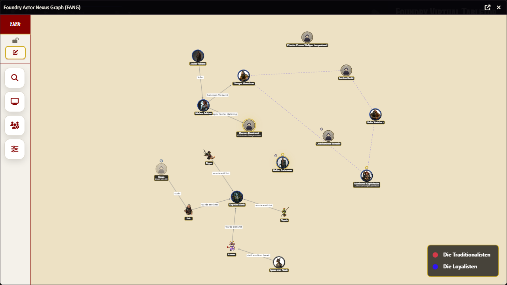
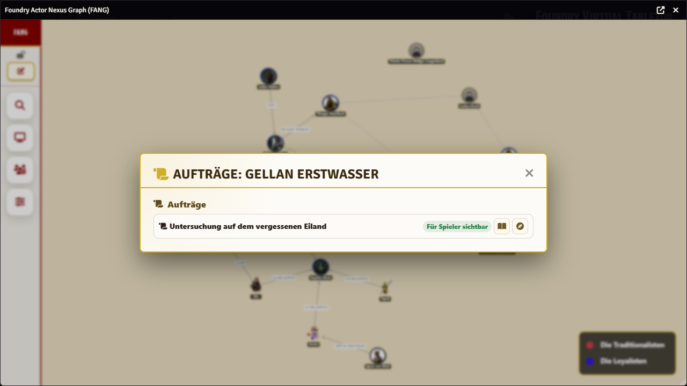
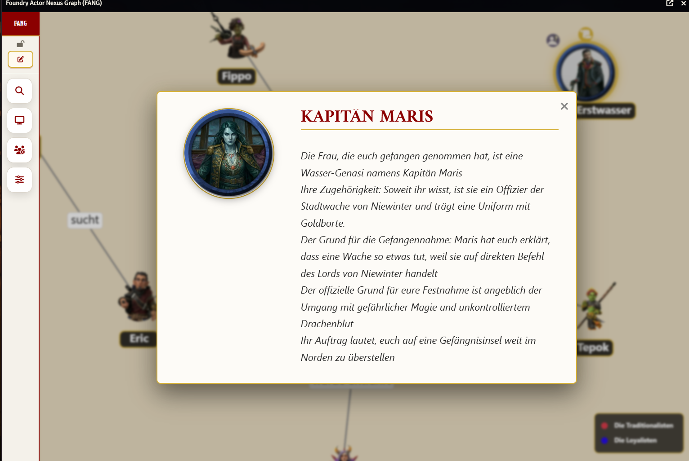

# Ninjo's FANG (Foundry Actor Nexus Graph)

A living relationship graph for Foundry VTT: characters, factions, locations and a chronicle of
what happened, all in one place.

*(Scroll down for the German version / Weiter unten auf Deutsch)*

---

## 🇬🇧 English

  
  
  

Every long campaign reaches the point where nobody quite remembers who still owes whom a favour,
which merchant secretly works for the thieves' guild, and why the baroness dislikes your party so
much. FANG draws that web as a living graph right inside Foundry. Drag your characters in, connect
them with a few words, and the graph arranges itself so you can see at a glance who belongs with
whom.

FANG also keeps a **chronicle** where your group records what happened on which game day. That
puts the story of your campaign and the people in it in one place.

### Relationships you can see

Every connection gets a label and a direction, such as "owes money to" or "is afraid of". Right-
click it to rename it, add notes, flip the arrow, or present the relationship as a big spotlight
with both portraits when something is revealed at the table. When the graph gets crowded, open the
list of all of a character's connections and edit them there.

Anchor important figures such as the big villain as a **boss** in the middle, with a glowing aura
that everything else gathers around. Anyone who does not exist as an actor yet starts out as a
**placeholder**. Once the character exists, drag it onto the placeholder and every connection
stays in place.

### Factions and locations

Give your characters **factions**, several at once if needed, because every good campaign has that
mercenary who officially works for the guild and secretly sits in the circle. Membership shows as a
coloured ring on the token and as a line between the members. **Locations** record where someone
is, from a whole region down to a single building.

At the push of a button the graph sorts itself by faction or by location, and every group gets its
own labelled area. Reset it and everything returns to where it was.

### The chronicle

In the chronicle your group writes down what happened. Entries are sorted by game day, not by when
someone typed them. FANG reads your world's calendar or a known calendar module for that, and
without a calendar it simply uses the real date. Above the chronicle sits a timeline with one dot
per game day, bigger the more happened that day.

A small switch tells apart things the group already knew at the time from a revelation about the
past it only learns today. Session recaps belong to a character and get their own journal page, so
longer texts have room. Quests can be attached to characters too, and stay hidden until you
reveal them.

### Working on the graph together

If you like, several people can work on the graph at the same time. When saving, FANG merges the
changes field by field, so two people working in different places do not get in each other's way,
and everyone sees the same layout. Your secrets as GM stay safe: players do not see hidden
characters, but they can still keep their own notes and nicknames for characters.

You can save the whole graph with all positions, factions and settings to a file and load it again.
Two themes, fantasy and cyberpunk, switch live, and FANG speaks ten languages. The first time you
open it, it explains itself in six short points.

### For games in the same room

When you all play in one room, **in-person mode** adds extra buttons for the monitor. Choose which
account is your group screen and send the graph there in fullscreen with one click. The view stays
calmly centred on the characters you marked as the centre.

### FANG Premium

FANG is free, fully usable, and it stays that way. If you want more, **FANG Premium** is an add-on
module for patrons that makes working on the graph together a lot more pleasant. You see who is
working on what, and you are asked before two people open the same editor. When someone drags a
character across the graph, it moves for everyone. What a player saves waits for a GM instead of
being lost. When two versions of the same text collide, you see both side by side and decide. A
change log shows who changed what and when, and every change can be undone on its own. Premium
also unlocks the custom background image that FANG already lists as a premium option.

How to get FANG Premium and what the tiers cost is on the [premium page](https://ninjos-forge.web.app/en/premium).

### Installation

FANG is in the official Foundry package catalogue. In Foundry, open the **Add-on Modules** tab,
click **Install Module** and search for *Ninjo's FANG*. Then enable it in your world's module
settings.

You can also install FANG from a manifest URL. For the stable version that is
`https://github.com/Niclasp1501/Foundry-Actor-Nexus-Graph--FANG-/releases/latest/download/module.json`,
and if you want to try new features early, use the beta at
`https://github.com/Niclasp1501/Foundry-Actor-Nexus-Graph--FANG-/releases/download/beta-latest/module-beta.json`.
Both install the same module, so a world can only use one of them. Back up your world before
trying a beta.

### Using FANG

As GM, open FANG from the **FANG Graph** journal entry, the button in the actor directory, or with
`Shift + G`. Switch on edit mode and the tools for connections and placeholders appear right on
the graph. Everything else about characters, quests and relationships is in the context menu.
**Show Players** opens the graph for everyone, **Show Monitor** puts it on your group screen, and
you close both just as quickly.

Your players open FANG from the journal entry or with `Shift + G` as well. You only need to have
opened the graph once yourself so that it exists. When players change something, it goes through
you. If you are not online at that moment, FANG says so clearly instead of silently doing nothing.

### Working with other modules

With **DiploGlass** installed, FANG takes over its factions including their icons and assigns the
characters by their reputation there. **Ninjo's In-Person Tools** give FANG a button in the tablet
sheet view, and **Sheet Only** users find it in that module's bar as before.

### Roadmap

What is planned next is in [TODO.md](TODO.md).

---

## 🇩🇪 Deutsch

  
  
  

In jeder längeren Kampagne kommt der Moment, in dem niemand mehr genau weiß, wer eigentlich
wem noch einen Gefallen schuldet, welcher Händler heimlich für die Diebesgilde arbeitet und
warum die Baronin eure Gruppe so wenig leiden kann. FANG zeichnet dieses Geflecht als
lebendigen Graphen direkt in Foundry. Du ziehst deine Figuren hinein, verbindest sie mit ein
paar Worten, und der Graph ordnet sich von selbst so an, dass man auf einen Blick sieht, wer zu
wem gehört.

Dazu führt FANG eine **Chronik**, in der ihr festhaltet, was an welchem Spieltag passiert ist.
So habt ihr die Geschichte eurer Kampagne und die Menschen darin an einem Ort.

### Beziehungen, die man sieht

Jede Verbindung bekommt eine Beschriftung und eine Richtung, etwa „schuldet Geld" oder „hat
Angst vor". Mit einem Rechtsklick benennst du sie um, schreibst Notizen dazu, drehst den Pfeil
oder stellst die Beziehung als großes Spotlight mit beiden Porträts vor, wenn am Tisch gerade
etwas enthüllt wird. Wird es im Graphen eng, öffnest du bei einer Figur einfach die Liste all
ihrer Verbindungen und bearbeitest sie dort.

Wichtige Figuren wie den großen Schurken verankerst du als **Boss** in der Mitte, mit einer
leuchtenden Aura, um die sich alles andere gruppiert. Und wer noch gar nicht als Akteur
existiert, bekommt erst einmal einen **Platzhalter**. Sobald es die Figur gibt, ziehst du sie auf
den Platzhalter, und alle Verbindungen bleiben erhalten.

### Fraktionen und Orte

Ordne deinen Figuren **Fraktionen** zu, auch mehrere auf einmal, denn die Söldnerin, die offiziell
für die Gilde arbeitet und heimlich im Zirkel sitzt, gibt es in jeder guten Kampagne. Die
Mitgliedschaft zeigt sich als farbiger Ring am Token und als Linie zwischen den Mitgliedern. Mit
**Orten** hältst du fest, wo sich jemand aufhält, von der Region bis zum einzelnen Gebäude.

Auf Knopfdruck sortiert sich der Graph nach Fraktion oder nach Ort, und jede Gruppe bekommt ihren
eigenen beschrifteten Bereich. Beim Zurücksetzen kehrt alles an seinen alten Platz zurück.

### Die Chronik

In der Chronik hält eure Runde fest, was geschehen ist. Einträge werden nach Spieltag sortiert,
nicht danach, wann jemand sie eingetippt hat. FANG liest dafür den Kalender eurer Welt oder eines
bekannten Kalendermoduls, und ohne Kalender nimmt es einfach das echte Datum. Über der Chronik
liegt eine Zeitleiste mit einem Punkt je Spieltag, der umso größer wird, je mehr an diesem Tag
passiert ist.

Ein kleiner Schalter unterscheidet zwischen Dingen, die die Gruppe schon damals wusste, und einer
Enthüllung über die Vergangenheit, die sie erst heute erfährt. Rückblicke auf eine Sitzung
gehören einer Figur und bekommen eine eigene Seite im Journal, damit auch längere Texte Platz
haben. Aufträge lassen sich ebenfalls an Figuren hängen und bleiben verdeckt, bis du sie aufdeckst.

### Gemeinsam am Graphen arbeiten

Auf Wunsch arbeiten mehrere Leute gleichzeitig am Graphen. Beim Speichern führt FANG die
Änderungen Feld für Feld zusammen, sodass sich zwei Leute, die an verschiedenen Stellen arbeiten,
nicht in die Quere kommen, und alle sehen dieselbe Anordnung. Deine Geheimnisse als Spielleiter
bleiben dabei geschützt: Verdeckte Figuren sehen die Spieler nicht, eigene Notizen und Spitznamen
für Figuren pflegen sie aber trotzdem.

Den ganzen Graphen mit allen Positionen, Fraktionen und Einstellungen kannst du als Datei sichern
und wieder einlesen. Zwei Designs, Fantasy und Cyberpunk, lassen sich live umschalten, und FANG
spricht zehn Sprachen. Beim ersten Öffnen erklärt es sich selbst in sechs kurzen Punkten.

### Für Runden vor Ort

Spielt ihr zusammen in einem Raum, blendet der **In-Person-Modus** zusätzliche Knöpfe für den
Monitor ein. Du legst fest, welches Konto euer Gruppenbildschirm ist, und schickst den Graphen mit
einem Klick als Vollbild dorthin. Der Bildausschnitt bleibt dabei ruhig auf die Figuren
gerichtet, die du als Zentrum markiert hast.

### FANG Premium

FANG ist kostenlos, vollständig benutzbar und bleibt es auch. Wer mehr möchte, bekommt mit
**FANG Premium** ein Zusatzmodul für Patrons, das die Zusammenarbeit am Graphen deutlich angenehmer
macht. Du siehst, wer gerade woran arbeitet, und wirst gefragt, bevor zwei Leute denselben Editor
öffnen. Zieht jemand eine Figur über den Graphen, bewegt sie sich bei allen mit. Was ein Spieler
speichert, wartet auf einen Spielleiter, statt verloren zu gehen. Stoßen
zwei Fassungen desselben Textes aufeinander, siehst du beide nebeneinander und entscheidest. Ein
Änderungsprotokoll zeigt, wer wann was geändert hat, und jede Änderung lässt sich einzeln
zurücknehmen. Außerdem schaltet Premium das eigene Hintergrundbild frei, das FANG schon jetzt als
Premium-Option anzeigt.

Wie du an FANG Premium kommst und was die Stufen kosten, steht auf der
[Premium-Seite](https://ninjos-forge.web.app/premium).

### Installation

FANG steht im offiziellen Foundry-Paketkatalog. Öffne in Foundry den Reiter **Add-on-Module**,
klicke auf **Modul installieren** und suche nach *Ninjo's FANG*. Danach aktivierst du es in den
Moduleinstellungen deiner Welt.

Du kannst FANG auch über eine Manifest-Adresse installieren. Für die stabile Fassung ist das
`https://github.com/Niclasp1501/Foundry-Actor-Nexus-Graph--FANG-/releases/latest/download/module.json`,
wer neue Funktionen früher ausprobieren möchte, nimmt die Beta unter
`https://github.com/Niclasp1501/Foundry-Actor-Nexus-Graph--FANG-/releases/download/beta-latest/module-beta.json`.
Beide installieren dasselbe Modul, du kannst in einer Welt also nur eine der beiden verwenden.
Lege vor einer Beta am besten eine Sicherung deiner Welt an.

### So benutzt du FANG

Als Spielleiter öffnest du FANG über den Journaleintrag **FANG Graph**, über den Knopf im
Akteursverzeichnis oder mit `Shift + G`. Schalte den Bearbeitungsmodus ein, und die Werkzeuge für
Verbindungen und Platzhalter erscheinen direkt auf dem Graphen. Alles Weitere zu Figuren,
Aufträgen und Beziehungen findest du im Kontextmenü. Mit **Spielern zeigen** öffnet sich der
Graph bei allen, mit **Monitor zeigen** auf eurem Gruppenbildschirm, und genauso schnell schließt
du beides wieder.

Deine Spieler öffnen FANG ebenfalls über den Journaleintrag oder mit `Shift + G`. Du musst den
Graphen nur einmal selbst geöffnet haben, damit er angelegt ist. Ändern Spieler etwas, läuft das
über dich. Bist du gerade nicht online, sagt FANG das deutlich, statt stillschweigend nichts zu
tun.

### Zusammen mit anderen Modulen

Ist **DiploGlass** installiert, übernimmt FANG dessen Fraktionen samt Symbol und ordnet die Figuren
nach ihrem Ansehen dort zu. Mit **Ninjo's In-Person Tools** bekommt FANG einen Knopf in der
Blattansicht der Tablets, und wer **Sheet Only** nutzt, findet ihn wie gewohnt in dessen Leiste.

### Was als Nächstes kommt

Geplante Funktionen stehen in [TODO.md](TODO.md).

---

## Credits & Third-Party Libraries
Special thanks to **GM MattCat** for bringing in the DiploGlass faction sync idea.

FANG loads [D3.js](https://d3js.org/) (ISC License) at runtime from d3js.org. It is not bundled with the module.

---

## License / Lizenz
FANG is free to install and use, including for paid games, but it is **not open source**. From version 14.2609.3 on, all rights are reserved except those granted in [LICENSE](LICENSE): you may use it and modify it for your own table, but not redistribute, rebundle or sell it. Versions up to and including 14.2609.2 were released under the MIT License and stay under it. The Ninjo logo (`assets/ninjo.png`) is not covered by any licence.

FANG ist kostenlos und darf auch für bezahlte Runden benutzt werden, ist aber **nicht Open Source**. Ab Version 14.2609.3 sind alle Rechte vorbehalten, außer denen in der [LICENSE](LICENSE): Nutzen und für den eigenen Tisch anpassen ja, weitergeben, in andere Pakete packen oder verkaufen nein. Die Versionen bis einschließlich 14.2609.2 sind unter der MIT-Lizenz erschienen und bleiben es. Das Ninjo-Logo (`assets/ninjo.png`) fällt unter keine Lizenz.
